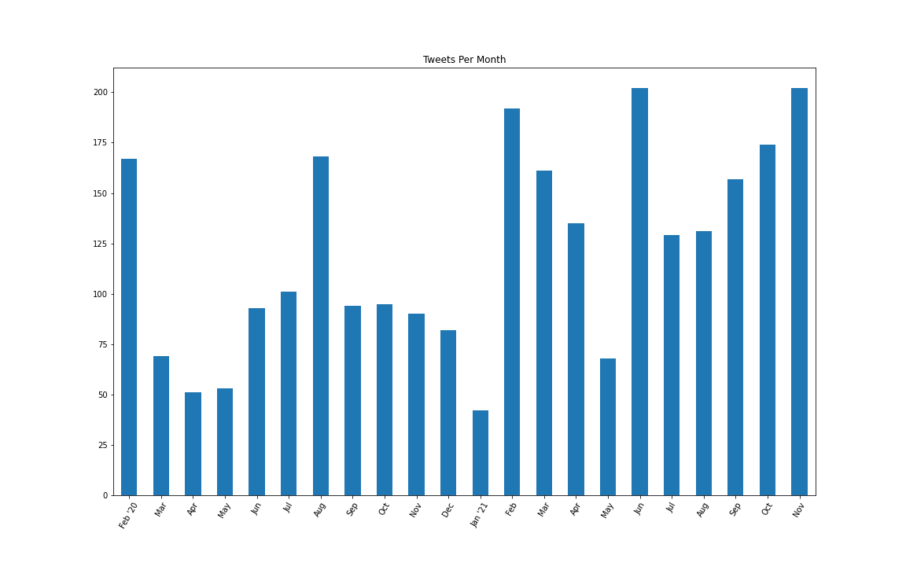
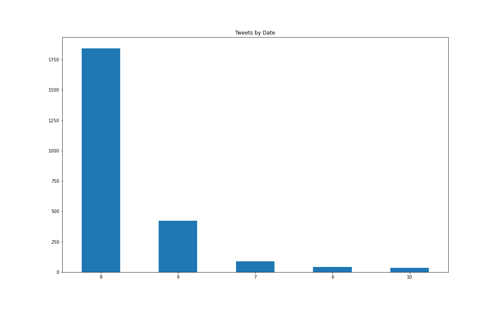

# A Brief Analysis of [#PodRevDay](https://www.stephfuccio.com/podrevday.html "What is #podrevday?") 

## ***What is [#podrevday](https://www.stephfuccio.com/podrevday.html)?*** 

The brainchild of [Ms. Stephanie Fuccio](https://www.stephfuccio.com/) where: 

>On the 8th of every month podcast listeners write a podcast review & post it on the socials with #PodRevDay to tell hard working Podcasters how much we love what they are doing. - *Source:* [*What is #PodRevDay?*](https://www.stephfuccio.com/podrevday.html#) 

## ***How do people take part in #PodRevDay?***

  

## ***#PodRevDay By the Numbers***

__934__: Tweets using the hashtag #PodRevDay  
__326__: Unique users have participted in #PodRevDay  
__575,430__: Followers of participants in #PodRevDay  
__16__: Minimum number of countries with participants  
__6.12__: Averge Number of people liking a tweet about #PodRevDay  
__2.18__: Average retweets per tweet about #PodRevDay  

## ***#PodRevDay Over Time***
The start of summer in the northern hemisphere has seen an increase in participation. 

Are the two related? 

Possibly: people are on vacation with no where to go so they might be listening to more podcasts and feel inclined to share a review. 

  

## ***#PodRevDay Participation by Day***
Unsurprisingly, the vast majortity of tweets take place on or near the eighth of each month. Good to see people can follow instructions :wink: 

  

## ***#PodRevDay's Global Expansion***

Unfortuanately, only half the participants' locations are public; however, we can still see that with each passing month, #podrevday attracts participants from an expanding list of countries.

